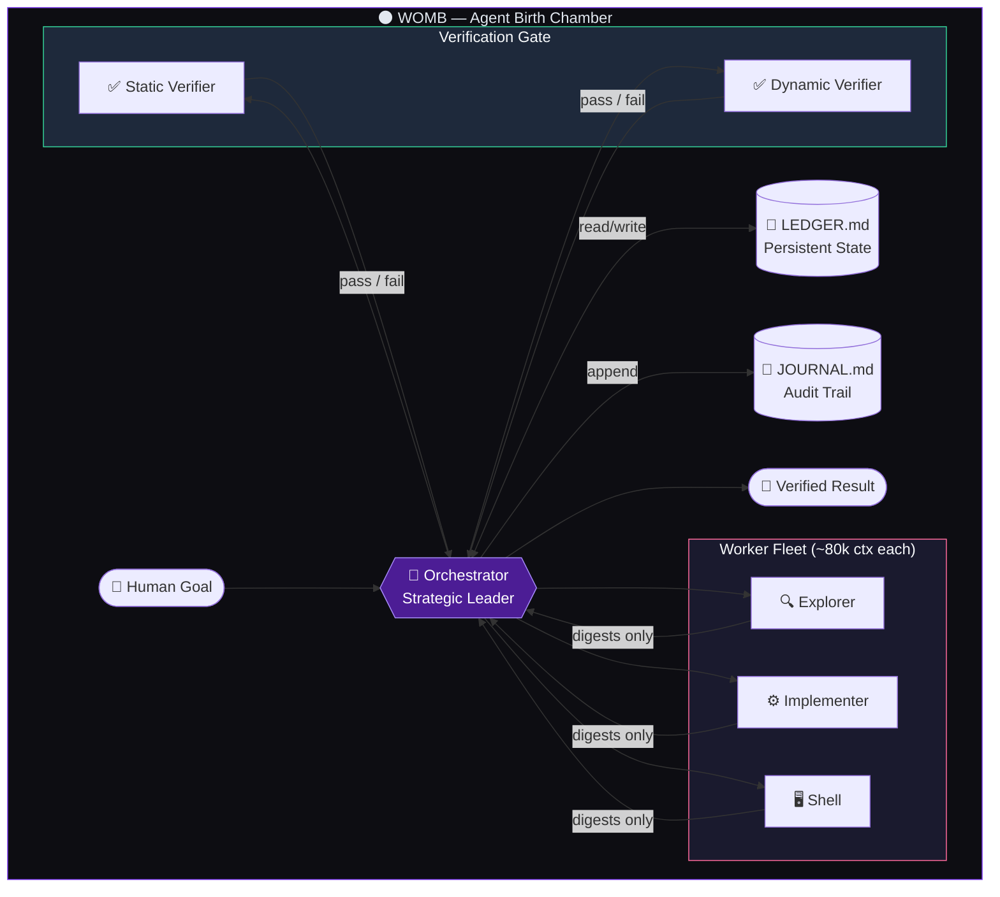

<div align="center">

# 🌑 Womb

### *Where agent intelligence is conceived, shaped, and born.*

<br/>

[](LICENSE)
[](https://cursor.com)
[](https://github.com/mahdiabbasinourabadi/Womb)

<br/>

```
        ╭──────────────────────────────────────────╮
        │                                          │
        │   ◉  ORCHESTRATOR  ──►  WORKER FLEET     │
        │         │                    │           │
        │         ▼                    ▼           │
        │    LEDGER ◄──────────►  VERIFIERS        │
        │         │                    │           │
        │         └──────►  BIRTH  ◄───┘           │
        │                  of skill                 │
        ╰──────────────────────────────────────────╯
```

<br/>

**Womb** is a research-grade toolkit for designing, orchestrating, and understanding  
**multi-agent AI systems** — from fleet command prompts to frontier model internals.

[Explore](#-what-is-womb) · [Architecture](#-architecture) · [Quick Start](#-quick-start) · [Structure](#-repository-structure)

</div>

---

## ✦ What is Womb?

Most AI tools treat the model as a **single brain**. Womb treats it as an **ecosystem**.

Inside this repository you'll find the blueprints for a different kind of intelligence:

| Layer | What it is | Why it matters |
|-------|-----------|----------------|
| **Orchestrator** | A high-capability leader agent | Thinks strategically, never drowns in logs |
| **Worker Fleet** | Fast, focused executor agents | Each gets ~80k tokens of clean context |
| **Verifiers** | Independent readonly auditors | Trust nothing until it's proven |
| **Ledger** | Persistent on-disk state | Survives context compaction and amnesia |
| **Prompt Archive** | Documented system prompt research | See how frontier models are actually steered |

Womb is not a framework you install. It's a **living laboratory** — patterns, prompts, and protocols you can drop into Cursor, Claude Code, or any agent runtime that speaks system prompts.

> *One orchestrator. Many workers. Zero context waste. Every birth verified.*

---

## 🧬 Architecture

The heart of Womb is the **Orchestrator → Worker → Verifier** pipeline — a command structure designed for fleets, not soloists.



### Core principles

1. **Context is currency** — The orchestrator never ingests raw logs, full diffs, or 2,000-line test output. Workers return *digests* with hard size caps.
2. **Implementer ≠ Verifier** — Fresh readonly agents verify every substantive unit. No self-confirmation bias.
3. **Ledger over memory** — `.orchestrator/LEDGER.md` is the source of truth, not chat history. It survives summarization.
4. **Parallel by default** — Independent units run concurrently. Verification pipelines while implementation continues.
5. **Proportional rigor** — A typo fix gets a test run. A new subsystem gets static + dynamic verification.

---

## 🚀 Quick Start

### 1. Clone the womb

```bash
git clone https://github.com/mahdiabbasinourabadi/Womb.git
cd Womb
```

### 2. Deploy the Orchestrator

Copy the orchestrator system prompt into your agent runtime:

```bash
# Cursor — paste into a custom rule, skill, or agent system prompt
cat templates/orchestrator-agent.md
```

Or reference it directly as a **Cursor Skill** / **Agent instruction file**.

### 3. Start a multi-agent run

On your first complex task, the orchestrator will create:

```
.orchestrator/
├── LEDGER.md      # Goal, decisions, unit status, file locks
├── JOURNAL.md     # Append-only completion log
└── diffs/         # Per-unit change snapshots (gitignored scratch)
```

Open `LEDGER.md` anytime to see exactly where the fleet stands — even after context resets.

### 4. Give the fleet eyes — Playwright runtime lane

Agents that only read code are guessing at runtime behavior. Womb's verification protocol requires UI-changing units to be verified against the **running app** via [Playwright](https://playwright.dev): a worker opens the real page, reads the accessibility snapshot and console errors, and returns a capped digest.

This repo ships a project-level MCP config (`.cursor/mcp.json`) that gives agents browser tools:

```json
{
  "mcpServers": {
    "playwright": {
      "command": "npx",
      "args": ["-y", "@playwright/mcp@latest", "--headless"]
    }
  }
}
```

**Headless is the default.** The orchestrator switches a unit to headed only when the user asks to watch the browser, or when it judges a visible browser serves the task (visual/timing debugging, demoing a finished flow) — remove `--headless` for those sessions. Screenshots and traces are written to `.orchestrator/artifacts/` and referenced by path, never pasted into agent context. See the `runtime_ui_verification` section of the orchestrator template for the full rules.

### 5. Study the frontier

Browse `system_prompts_leaks/` for annotated research on how production AI systems are instructed at the system level. Educational and comparative analysis only.

---

## 📁 Repository Structure

```
Womb/
│
├── templates/
│   └── orchestrator-agent.md     # Full orchestrator system prompt (~540 lines)
│                                 # Fleet registry, verification protocol, brief format,
│                                 # Playwright runtime UI verification lane
│
├── .cursor/
│   └── mcp.json                  # Playwright MCP server (headless) — browser tools for agents
│
├── system_prompts_leaks/
│   └── Anthropic/
│       └── claude-fable-5.md     # Research archive: Claude Fable 5 system prompt
│
├── .orchestrator/
│   ├── LEDGER.md                 # Live orchestration state (example)
│   └── JOURNAL.md                # Unit completion audit log (example)
│
├── README.md                     # You are here
├── LICENSE                       # MIT
└── .gitignore
```

---

## 🎯 Who is this for?

| You are… | Womb gives you… |
|----------|-----------------|
| **Agent builder** | Battle-tested orchestration patterns with verification baked in |
| **Cursor power user** | A drop-in leader prompt for complex multi-step projects |
| **AI researcher** | Primary-source system prompt material for comparative study |
| **Engineering lead** | A mental model for running AI like a small, accountable team |

---

## 🔬 The Orchestrator in 30 Seconds

The orchestrator **does not do the work**. It:

- Decomposes goals into worker-sized units
- Writes self-contained briefs with acceptance criteria
- Spawns `explore`, `generalPurpose`, and `shell` workers in parallel
- Runs independent verifiers on every load-bearing output
- Merges verified digests into one coherent answer

Hard rule: the orchestrator may only edit ~10 lines itself. Everything else is delegated.

```text
Bad:  "Look at the project and improve it."
Good: "In repo /app, login returns 401 after token refresh.
       Read src/auth/refresh.ts only. Minimal fix.
       Acceptance: auth tests pass. Return: cause (3 sentences max)."
```

---

## 🌊 Philosophy

> *Intelligence scales better as organization than as raw capability.*

A single 200k-context model trying to read every file, run every test, and review its own diff is a **generalist drowning**. Womb inverts the pyramid: one strategist with maximum context budget, many specialists with tight scopes, and a verification layer that treats every claim as guilty until proven.

The name **Womb** is deliberate. Skills, agents, and orchestration patterns don't arrive fully formed — they are **gestated**: briefed, built, verified, and born into your codebase.

---

## ⚠️ Research Disclaimer

The `system_prompts_leaks/` directory contains materials gathered for **educational and research purposes** — understanding how frontier models are instructed, safety-gated, and product-bound. These files are not affiliated with or endorsed by any model provider. Use responsibly and in accordance with applicable terms of service.

---

## 🤝 Contributing

Womb is an open experiment. Contributions welcome:

- New orchestrator patterns or verification strategies
- Additional annotated system prompt research (clearly sourced)
- Agent templates for other runtimes (Claude Code, Codex, custom)
- Real-world case studies using the ledger protocol

Open an issue or PR on [GitHub](https://github.com/mahdiabbasinourabadi/Womb).

---

## 📜 License

MIT — see [LICENSE](LICENSE).

---

<div align="center">

<br/>

**Built with curiosity by [mahdiabbasinourabadi](https://github.com/mahdiabbasinourabadi)**

<br/>

*Don't hire a bigger model. Birth a fleet.*

🌑

</div>
